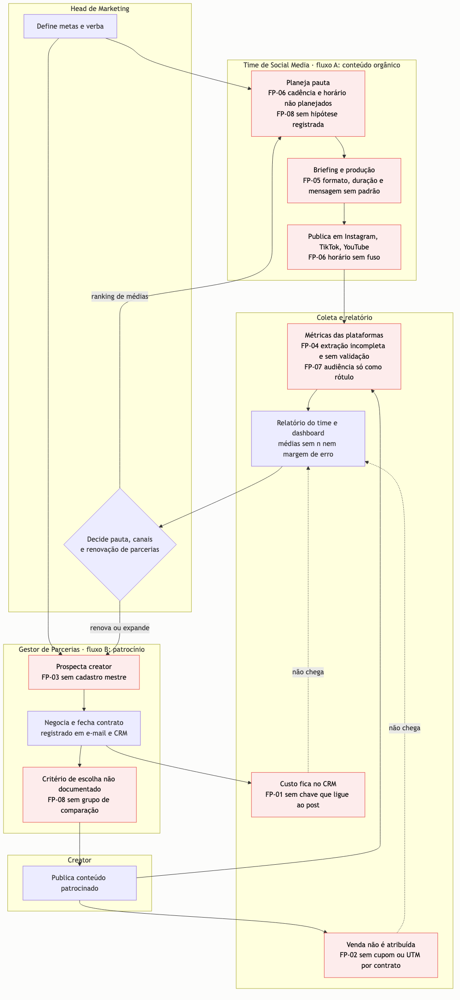
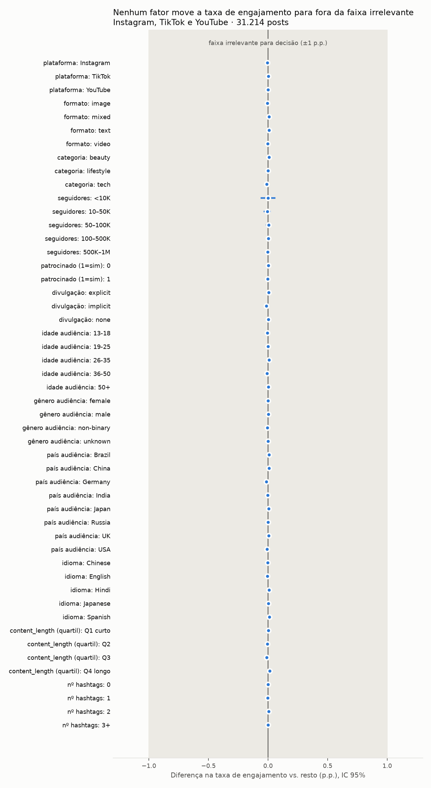
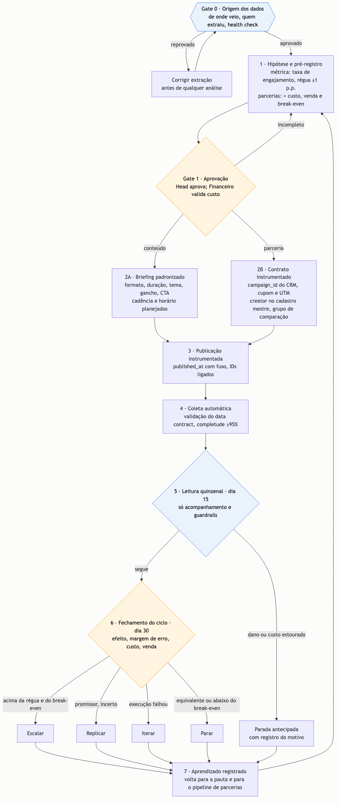
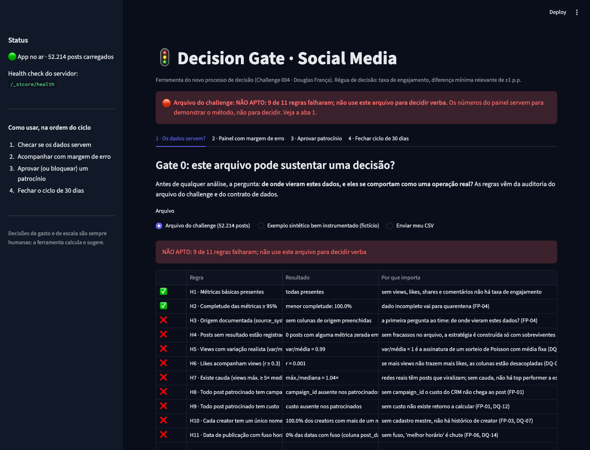

# Submissão — Douglas França — Challenge 004

## Sobre mim

- **Nome:** Douglas França
- **LinkedIn:** [linkedin.com/in/douglas-frança](https://www.linkedin.com/in/douglas-fran%C3%A7a/)
- **Challenge escolhido:** 004 — Estratégia Social Media

---

## Executive Summary

Auditei os 52.214 posts antes de analisar e provei **por que** eles não sustentam decisão: views, likes, shares e comentários foram sorteados de uma distribuição de Poisson com **a mesma média para todos os posts** (variância/média entre 0,99 e 1,00). Com uma régua de decisão definida antes dos testes (±1 p.p. de taxa de engajamento), as **335 comparações** feitas em Instagram, TikTok e YouTube deram **equivalentes**: nem canal, formato, creator, audiência ou patrocínio muda o resultado. Patrocínio empata com orgânico (−0,003 p.p.) e, no melhor cenário, gera 0,77 interação extra por post, o que cobre **menos de 1%** do fee de um micro-influenciador. Por isso, a recomendação não é trocar de canal: é **suspender novos patrocínios, ligar o custo do CRM ao post e à venda, e decidir em ciclos de 30 dias com régua prévia**. Entrego o processo redesenhado (com a IA nos pontos certos e um dono para cada decisão) e o [**Decision Gate**](https://decision-social-doug.streamlit.app), a ferramenta que executa esse processo.

---

## Solução

| O quê | Onde |
|---|---|
| 🚦 **Ferramenta no ar** (sem login, sem instalação) | **https://decision-social-doug.streamlit.app** |
| Estratégia priorizada para o Head | [`reports/strategy.md`](reports/strategy.md) |
| Resumo de 1 página | [`reports/executive-one-pager.md`](reports/executive-one-pager.md) |
| Arquitetura de processo (AS-IS → TO-BE, IA, RACI, dados, 30/60/90) | [`docs/process/`](docs/process/README.md) |
| Auditoria dos dados | [`docs/data-quality-report.md`](docs/data-quality-report.md) |
| Análise estatística | [`docs/statistical-report.md`](docs/statistical-report.md) |

### Abordagem

Trabalhei em **gates**: cada etapa só fecha com uma decisão minha registrada em [`process-log/decisions.md`](process-log/decisions.md).

| Gate | Pergunta | Resultado |
|---|---|---|
| **G1 · Baseline** | O que a IA entrega sozinha? | Colei o brief cru em 5 IAs e conferi com código as 19 afirmações numéricas que elas fizeram. Uma **inventou o dataset**, outra vendeu um artefato matemático como insight, e a melhor já concluía "não há sinal". Conclusão: honestidade estatística é o **piso**; o diferencial precisa estar na operação |
| **G2 · Auditoria** | Estes dados descrevem uma operação real? | Não. 16 achados, incluindo o mecanismo (Poisson com λ fixo) e 8 lacunas ligadas a falhas de processo |
| **G3 · Análise** | Algo muda a decisão? | Régua pré-registrada de ±1 p.p.; efeito, IC 95%, teste de equivalência (TOST), MDE, correção para múltiplos testes. Nada muda a decisão |
| **G4 · Processo** | Que operação gera dados assim, e como consertar? | Dois fluxos (conteúdo e parcerias), 8 pontos de falha, TO-BE em ciclo de 15/30 dias, matriz de IA, RACI, contrato de dados |
| **G5 · Estratégia** | O que fazer na segunda-feira? | 7 decisões com dono e condição de parada, custo implícito com preços de mercado, 3 testes |
| **G6 · Ferramenta** | Como rodar isso todo dia? | Decision Gate em 4 abas, 24 testes, publicado |

**Escopo:** a empresa investe em **Instagram, TikTok e YouTube**. Bilibili e RedNote (também presentes no arquivo) entram só como referência, por não alcançarem o público brasileiro.

### Resultados / Findings

#### 1. O arquivo não serve para decidir, e isto explica por quê


| Achado | Número | Consequência |
|---|---|---|
| Métricas sorteadas com média fixa | variância/média: views 0,99 · likes 1,00 · shares 1,00 · comments 0,99; em 76 segmentos, 0,94–1,04 | Nenhuma característica do post influencia o resultado |
| Sem cauda e sem fracasso | 0 posts com métrica zero; maior post = 1,09× as views do menor | Não há "top performer" a copiar |
| Métricas desacopladas | r(likes, views) = 0,001 | Alcance não gera interação neste arquivo |
| Sem cadastro de creator | 100% dos 5.000 creators com mais de 1 nome | Tamanho de creator não é confiável |
| Sem custo, campanha ou venda | colunas inexistentes | **ROI é incalculável** |
| Publicação uniforme 24h, cadência fixa, duração sem unidade | 3h = 2.193 posts vs 19h = 2.267; 10–11 posts por creator | Horário, frequência e duração não são testáveis |

#### 2. Respostas às perguntas do Head

| Pergunta | Resposta com dados | O que fazer |
|---|---|---|
| **O que gera engajamento?** | Nada que o arquivo registra. 50 fatores × nível: maior diferença 0,014 p.p. (MDE 0,019) | Testar formato **dentro de cada canal** com briefing padronizado (EXP-02) |
| **Patrocínio funciona?** | Equivalente ao orgânico: **−0,003 p.p.** (IC −0,014 a +0,008), ajustado por canal, formato, categoria, faixa, audiência e idioma, com erro agrupado por creator. Views: +0,03% no melhor caso. 23 condições e 81 células comparáveis: todas equivalentes | Suspender contratos novos até terem custo, cupom/UTM e grupo de comparação |
| **Custo implícito?** | No melhor cenário, **0,77 interação extra por post**. A R$ 5 por interação: R$ 3,87 por post. Um micro cobra R$ 500–3.000 (**129× a 775×**); um grande, R$ 15–100 mil | Patrocínio só se paga por **venda atribuída** (ex.: fee de R$ 3.000 com margem de R$ 50 exige 60 vendas extras) |
| **Threshold de seguidores?** | Não existe: de 0 a 1 milhão de seguidores, **−0,001 p.p.** (IC −0,020 a +0,018) | Contratar por auditoria de audiência, fit e custo por resultado |
| **Qual audiência engaja mais?** | Nenhuma. 160 perfis: 6 "significativos" sem correção, **menos que os 8 esperados por acaso**; 0 com correção | Registrar a distribuição real de audiência por post |
| **O que NÃO funciona?** | Ranking de médias; contratar por seguidores; engajamento ÷ seguidores (artefato 1/x); otimizar hashtags (93 mil pares, nenhum com mais de 5 posts); p < 0,05 sem correção ("moda é pior" e "#religious é melhor" somem); modelo preditivo (R² = −0,001) | Parar essas práticas |
| **Frequência?** | Não testável: cadência fixa no arquivo | Rollout escalonado no 2º ciclo (EXP-03) |



#### 3. O processo redesenhado


- **Gate 0:** antes de analisar, perguntar de onde vieram os dados e rodar o health check.
- **Pré-registro e Gate 1:** hipótese, régua e break-even antes de gastar; **aprovação humana** (Head + Financeiro).
- **Leitura de 15 dias** só acompanha; **decisão no dia 30**: Escalar, Replicar, Iterar ou Parar.
- **IA:** faz checagens, cálculos, coleta e relatórios; **ajuda** em hipóteses, briefings e triagem de creators; **nunca decide** gasto, régua, negociação, marca ou escala. Uma tarefa só ganha autonomia com < 5% de correção por 8 semanas.
- **RACI:** o Financeiro valida o break-even; o AI Master opera o grupo de comparação; o Head decide. Sem novas contratações.

#### 4. Decision Gate: a ferramenta do dia a dia
| Aba | O que faz |
|---|---|
| 1 · Os dados servem? | 11 regras do contrato de dados. **O arquivo do challenge é reprovado em 9** |
| 2 · Painel com margem de erro | Cada grupo contra o resto, com n, IC 95%, p ajustado e veredito. Sem ranking |
| 3 · Aprovar patrocínio | Bloqueia contrato incompleto; calcula vendas para empatar e tamanho do teste |
| 4 · Fechar ciclo | Sugere a decisão de 30 dias pela regra pré-registrada |



### Recomendações

| Prioridade | Decisão | Dono |
|---|---|---|
| **P0 · semana 1** | Suspender novos contratos de patrocínio | Head de Marketing |
| **P0 · semana 1** | Auditar a origem dos dados (quem extraiu, de onde, como) | Head + AI Master |
| **P0 · semanas 1–2** | Ligar o custo do CRM ao post e à venda: `campaign_id`, cupom e UTM por contrato | Gestor de Parcerias |
| **P0 · dias 8–15** | Ativar o contrato de dados e o cadastro mestre de creators | AI Master |
| **P1 · dias 16–30** | Rodar EXP-01 (patrocínio → venda) e EXP-02 (formato por canal) | Head de Marketing |
| **P1 · imediato** | Dashboard com n e margem de erro; fim do ranking de médias | AI Master |
| **P2 · dias 31–90** | Mudar verba só com efeito replicado em 2 ciclos e retorno acima do break-even | Head + Financeiro |

**Quick wins desta semana:** reunião de origem dos dados · comunicado de suspensão · lista de contratos ativos sem custo · cupom e UTM para os ativos · selo de margem de erro no dashboard.

Detalhes, KPIs e condições de parada: [`reports/strategy.md`](reports/strategy.md).

### Limitações
- As conclusões valem **para este arquivo**, que foi gerado por sorteio. Elas não dizem que patrocínio, formatos ou canais não funcionam no mundo real; dizem que **este registro não permite saber**.
- O arquivo não traz custo nem venda. O custo implícito usa o melhor cenário estatístico e faixas de preço de mercado (pesquisa com fontes), não contratos reais.
- O valor de uma interação, a margem por venda e o desvio real da taxa de engajamento são **parâmetros de negócio**, apresentados em cenários.
- As causas operacionais do AS-IS combinam evidência do arquivo, minha vivência de operação e hipóteses marcadas como tal; precisam ser validadas com o time.
- O app usa os dados do challenge apenas para demonstrar o método; os exemplos "bem instrumentados" são **fictícios** e rotulados.

---

## Process Log — Como usei IA

### Ferramentas usadas

| Ferramenta | Para que usei |
|---|---|
| **Claude Code (Opus 5)** | Orquestrador da sessão: análise do repositório e dos reviews públicos, código de auditoria e estatística, documentação, diagramas, app e testes. Sempre com aprovação de edição |
| **Subagentes do Claude Code** ([`.claude/agents/`](.claude/agents/)) | Contratos de trabalho por etapa: auditor de dados, estatístico, arquiteto de processo, estrategista, construtor da ferramenta, redator executivo, revisor, guardião do process log |
| **ChatGPT, DeepSeek, Grok, Claude.ai, Gemini** | Baseline: o brief colado sem contexto, para medir o que a IA entrega sozinha ([`process-log/baseline/`](process-log/baseline/)) |
| **Pesquisa web** | Faixas de preço de influenciadores no Brasil (fontes citadas em `str-market-fees.csv`) |
| Ferramentas de apoio (não IA) | pandas, scipy, statsmodels, scikit-learn, Streamlit, Plotly, mermaid-cli, Playwright, uv, git |

### Workflow

1. **Calibração da barra:** li o brief, o guia de submissão, os 122 PRs e os 181 reviews publicados pelo avaliador, para entender o critério real e o que já tinha sido entregue no 004. Nada foi copiado.
2. **Plano e agentes:** desenhei as etapas G0–G9 e 8 subagentes com contrato de entrada e saída, cada um com um gate humano ([`CLAUDE.md`](CLAUDE.md)). Modo de permissão com aprovação; a IA não consegue abrir PR.
3. **G1 · Baseline:** colei o brief cru em 5 IAs e mandei conferir cada número contra o dataset ([`g1-baseline-claims-check.csv`](outputs/tables/g1-baseline-claims-check.csv)). Escrevi a rubrica de diferenciação **antes** de construir ([`docs/differentiation-rubric.md`](docs/differentiation-rubric.md)).
4. **G2 · Auditoria:** a IA rodou os testes forenses; decidi tratar a descoberta como o achado principal do relatório.
5. **G3 · Análise:** **defini a régua (±1 p.p. de taxa de engajamento) antes de qualquer teste**; a IA executou e eu revisei os resultados.
6. **G4 · Processo:** trouxe como a operação funciona (quem fecha contrato, onde fica o registro, como o resultado chega ao Head) e corrigi o rumo quando o trabalho puxava só para parcerias.
7. **G5 · Estratégia:** aprovei as decisões e trouxe os preços de mercado para o custo implícito.
8. **G6 · Ferramenta:** escolhi o escopo fechado e a publicação online; revisei as telas no navegador.
9. **Cada gate terminou em commit** ([histórico da branch](https://github.com/douglasfrannca/ai-master-challenge/commits/submission/douglas-franca)).

### Onde a IA errou e como corrigi

O registro completo, com as entradas feitas no momento do erro, está em [`process-log/ai-errors.md`](process-log/ai-errors.md). Os principais:

| Erro | Como foi detectado | Correção |
|---|---|---|
| **Baseline:** Gemini inventou o dataset e os achados ("Tech e Health", "3,2×"); Grok vendeu engajamento ÷ seguidores como insight; Claude errou o período; DeepSeek leu 37% do CSV | Checagem numérica de 19 afirmações | Vira a seção "O que NÃO funciona" |
| O Claude Code rotulou como **evidência** que o patrocínio "não foi aleatorizado", mas os dados mostram balanceamento perfeito | Os próprios números do G1 contradiziam a afirmação | Reescrito: a evidência é a ausência do campo de critério |
| O Claude Code escreveu um veredito ("~1,1×") **antes** de rodar a conta; o real era 1,02× | Execução do script | Vereditos passaram a vir do valor calculado |
| O Claude Code citou amplitudes calculadas com 5 redes numa estratégia para 3 canais | Conferência contra `inf-factors.csv` | Corrigido para 0,007 e 0,014 p.p. |
| A regra de decisão chamava de "promissor" um efeito negativo | Revisão ao escrever os testes | Nova regra + teste automático |
| O `.gitignore` deixaria a base do app fora do commit, e o app publicado abriria vazio | Conferência dos arquivos no stage | Regra corrigida antes do deploy |
| A análise puxava só para parcerias | **Eu percebi:** "estamos indo só para o lado das parcerias?" | Processo com dois fluxos de mesmo peso |

### O que eu adicionei que a IA sozinha não faria

Tudo abaixo está registrado, com data e alternativa rejeitada, em [`process-log/decisions.md`](process-log/decisions.md).

- **Ler os dados como quem opera o negócio.** As IAs respondem "o que os dados mostram". Eu pergunto "por que os dados estão assim, e o que isso diz sobre como trabalhamos?". Quando 52 mil posts não registram quanto custou cada patrocínio, isso é o retrato de uma operação que contrata sem medir.
- **Recorte pelo negócio:** Bilibili e RedNote não alcançam o público brasileiro; a estratégia é para os três canais da empresa.
- **A régua antes do teste:** a decisão de verba muda com ±1 p.p. de taxa de engajamento, e só com ela.
- **O que eu diria ao Head na segunda-feira:** "Os dados que você me enviou não servem para tomarmos uma decisão. Me explique de onde vocês retiraram estes dados. Vamos verificar os contratos sem custo e suspender novos patrocínios, medir custo contra vendas de cada contrato, analisar a cada 15 dias e fechar um ciclo a cada 30."
- **Como a operação funciona de verdade:** o gestor de parcerias fecha o contrato, que fica no e-mail e no CRM; o resultado chega por relatório e dashboard. Isso mudou o diagnóstico: o custo existe, mas **não chega ao post**.
- **Não perder o brief de vista:** exigi que conteúdo orgânico e parcerias tivessem o mesmo peso no processo.
- **Preço de mercado:** trazer os fees reais de influenciadores transformou "o engajamento não paga" numa conta concreta.

---

## Evidências

- [x] **Chat exports:** respostas literais das 5 IAs do baseline ([`process-log/baseline/`](process-log/baseline/))
- [ ] **Transcript da sessão de trabalho:** [`process-log/chat-exports/`](process-log/chat-exports/) _(exportar no G9)_
- [x] **Screenshots do app:** [`outputs/figures/app/`](outputs/figures/app/)
- [x] **Screenshots das conversas com as IAs:** [`process-log/screenshots/`](process-log/screenshots/) — 46 prints das 5 IAs (ChatGPT 8 · DeepSeek 9 · Grok 6 · Claude.ai 16 · Gemini 7)
- [x] **Git history:** um commit por gate ([branch `submission/douglas-franca`](https://github.com/douglasfrannca/ai-master-challenge/commits/submission/douglas-franca))
- [x] **Decisões humanas e erros da IA:** [`decisions.md`](process-log/decisions.md) · [`ai-errors.md`](process-log/ai-errors.md)
- [x] **Outro:** app no ar ([decision-social-doug.streamlit.app](https://decision-social-doug.streamlit.app)), 24 testes automáticos, scripts reproduzíveis

### Como reproduzir
```bash
cd submissions/douglas-franca
uv sync
uv run python scripts/download_data.py        # dataset do Kaggle, sem login
uv run python src/audit/verify_baseline_claims.py
uv run python src/audit/run_audit.py
uv run python src/analysis/run_inference.py
uv run python src/analysis/implied_cost.py
uv run pytest
uv run streamlit run app/streamlit_app.py
```

---

_Submissão enviada em: [data do PR]_
