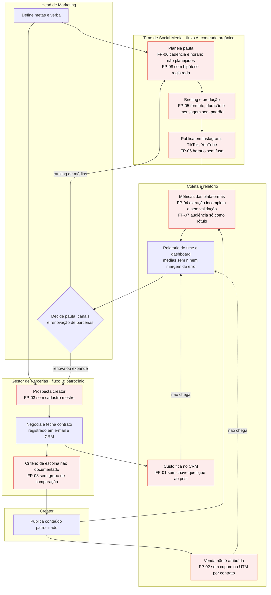

# 01 · Processo atual (AS-IS)

> **Em 3 linhas:** a operação tem dois fluxos, **conteúdo orgânico** e **parcerias**, que terminam no mesmo lugar: um relatório do time e um dashboard que levam o Head a decidir pauta e verba. Nos dois fluxos, a decisão é tomada **sem régua prévia, sem comparação e sem ligar custo a resultado**. Os pontos vermelhos (FP) são as falhas que o arquivo de 52 mil posts deixa visíveis.

Fontes: brief do challenge; vivência de operação do Douglas (`process-log/decisions.md`, G4); lacunas do dado (`docs/gap-to-process-map.md`).

> **Premissa a validar.** O brief não descreve como a operação funciona. As etapas que vêm da vivência do Douglas (contrato registrado no e-mail e no CRM, resultado reportado ao Head por relatório e dashboard) são **premissas**, confirmadas ou corrigidas na semana 1 (STR-02, reunião de origem dos dados). As que vêm do arquivo são evidência.

## Leitura para o Head
| Fluxo | O que acontece hoje | Por que isso impede decidir |
|---|---|---|
| **A · Conteúdo orgânico** | A pauta nasce sem hipótese; formato, duração, cadência e horário não são padronizados nem registrados; o resultado vira média no dashboard | Não há como saber **o que** funcionou nem **por quê**: o arquivo não tem variação de cadência, não tem unidade de duração e não tem horário com fuso |
| **B · Parcerias** | O gestor fecha o contrato e registra no e-mail e no CRM; o creator publica; o resultado volta como engajamento | O **custo está no CRM, mas não chega ao post**, e a **venda não é atribuída**. Sem essas duas pontas não existe retorno a calcular, só engajamento, que é igual ao orgânico |
| **Decisão (comum)** | Relatório e dashboard com médias levam o Head a decidir pauta e verba | Sem régua prévia, sem margem de erro e sem grupo de comparação, **sempre aparece um "vencedor"**, mesmo quando é ruído (G3: 332 comparações, todas equivalentes) |
