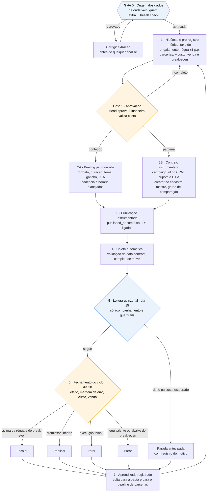

# 03 · Processo redesenhado (TO-BE)

> **Em 3 linhas:** os dois fluxos (conteúdo e parcerias) passam a entrar num **ciclo único de aprendizado**: nenhum post ou contrato começa sem hipótese e régua, nenhum dado entra sem validação, e nenhuma verba muda sem o fechamento de 30 dias. O ritmo é o definido pelo Douglas: **leitura a cada 15 dias, decisão a cada 30**. A IA faz a checagem e o cálculo; aprovar gasto e decidir escala continuam humanos.

Legenda: azul = gate automático com revisão · amarelo = decisão humana obrigatória.

## As regras do ciclo

| Momento | O que acontece | Regra |
|---|---|---|
| **Gate 0 · Origem** | Antes de qualquer análise, a pergunta do Douglas: "de onde vocês retiraram estes dados, e de que forma?" | Sem origem documentada e health check aprovado, **não há análise**. Este arquivo de 52 mil posts seria reprovado aqui (DQ-05) |
| **1 · Pré-registro** | Hipótese, métrica primária, régua, duração do ciclo, grupo de comparação e, em parcerias, custo total e break-even | Escrito **antes** de publicar; não pode mudar depois de ver o resultado |
| **Gate 1 · Aprovação** | Head aprova o teste; Financeiro valida custo e break-even das parcerias | **Regra de entrada:** nenhum contrato novo de patrocínio é assinado sem passar por este gate (custo, cupom/UTM, grupo de comparação). Ativos seguem; exceção só com aprovação do Head, registrada. Decisão do Douglas; no G8 deixou de ser "suspensão" |
| **2A · Conteúdo** | Briefing padronizado para Instagram, TikTok e YouTube | Toda peça registra formato, duração em segundos, tema, gancho, CTA, horário planejado |
| **2B · Parceria** | Contrato no CRM gera `campaign_id`, cupom e UTM | Post patrocinado sem `campaign_id` não entra na leitura |
| **4 · Coleta** | Extração automática com validação | Completude mínima de 95% dos campos do data contract; o que falha fica em quarentena |
| **5 · Leitura de 15 dias** | Acompanhamento: volume, custo, guardrails (queda de engajamento além da régua, brand safety, estouro de custo) | **Não se declara vencedor no dia 15.** Olhar e decidir cedo aumenta a chance de confundir sorte com resultado. Só se para por dano |
| **6 · Fechamento de 30 dias** | Efeito com margem de erro, custo, venda e retorno | **Escalar:** efeito acima de +1 p.p. **e** retorno acima do break-even · **Replicar:** promissor, com margem de erro larga · **Iterar:** falha de execução ou de dado · **Parar:** equivalente (dentro de ±1 p.p.) ou abaixo do break-even |
| **7 · Aprendizado** | O resultado vira registro consultável | A próxima pauta e o próximo contrato partem do que foi aprendido, não do ranking de médias |

## Como o novo processo responde às perguntas do brief
| Pergunta do Head | Como passa a ser respondida |
|---|---|
| O que gera engajamento? | Testes de formato, duração e tema **dentro de cada canal** (2A), com régua de ±1 p.p. |
| Vale patrocinar? | Contrato com custo, venda atribuída e grupo de comparação (2B); decisão pelo break-even no dia 30 |
| Qual audiência engaja? | Distribuição de audiência por post e por creator (data contract), testada por segmento pré-registrado |
| Onde concentrar esforço? | Ciclos de 30 dias acumulam evidência por canal, formato e faixa de creator; escala só com resultado replicado |
| Frequência de postagem? | Cadência planejada × realizada vira variável testável (rollout escalonado) |
| O que parar? | Tudo que fechar o ciclo como **Parar** sai da pauta ou do pipeline |
