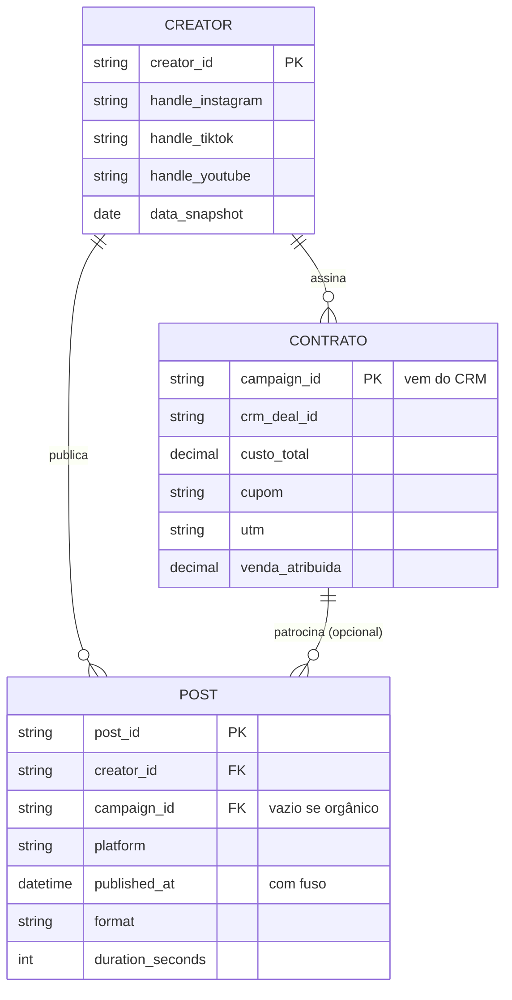

# 06 · Contrato de dados

> **Em 3 linhas:** três tabelas ligadas por chaves (**post**, **contrato** e **creator**) e um conjunto de regras de entrada. Cada campo existe para fechar uma falha (FP) e tem um dono. Dado que não passa nas regras fica em quarentena e não entra na leitura. É isso que faz o próximo arquivo **servir para decidir**.

## Tabela POST (fluxos A e B)
| Campo | Tipo | Obrigatório | Dono | Fecha |
|---|---|:-:|---|---|
| `post_id` | texto (ID da plataforma) | ✅ | AM | FP-04 |
| `creator_id` | texto (cadastro mestre) | ✅ | SM / GP | FP-03 |
| `campaign_id` | texto (do CRM); vazio = orgânico | se patrocinado | GP | FP-01 |
| `platform` | Instagram · TikTok · YouTube | ✅ | SM | — |
| `published_at` | data e hora **com fuso** | ✅ | SM | FP-06 |
| `planned_at` | data e hora planejada | ✅ | SM | FP-06 |
| `format` | vídeo · imagem · carrossel · texto | ✅ | SM | FP-05 |
| `duration_seconds` / `word_count` / `slides` | número, conforme o formato | ✅ | SM | FP-05 |
| `theme`, `hook`, `cta` | taxonomia fechada | ✅ | SM | FP-05 |
| `hypothesis_id` | ID do pré-registro | ✅ | SM / GP | FP-08 |
| `test_arm` | tratamento · comparação | se em teste | AM | FP-08 |
| `views`, `reach_unique`, `likes`, `shares`, `comments`, `saves` | inteiros **incluindo zero** | ✅ | AM | FP-04 |
| `link_clicks` | inteiro | ✅ | AM | FP-02 |
| `audience_age_pct`, `audience_gender_pct`, `audience_country_pct` | distribuição (%) | ✅ | AM | FP-07 |
| `source_system`, `extracted_at`, `extracted_by` | origem da linha | ✅ | AM | FP-04 |

## Tabela CONTRATO (fluxo B)
| Campo | Tipo | Obrigatório | Dono | Fecha |
|---|---|:-:|---|---|
| `campaign_id` | texto, gerado pelo CRM | ✅ | GP | FP-01 |
| `crm_deal_id` | ID do pipeline de parceria | ✅ | GP | FP-01 |
| `creator_id` | cadastro mestre | ✅ | GP | FP-03 |
| `fee`, `custo_producao`, `custo_midia`, `custo_total` | moeda | ✅ | GP / FIN | FP-01 |
| `objetivo` | alcance · engajamento · venda | ✅ | GP | FP-08 |
| `hypothesis_id`, `metrica_primaria`, `regua`, `break_even` | do pré-registro | ✅ | HM / FIN | FP-08 |
| `grupo_comparacao` | descrição e IDs | ✅ | AM | FP-08 |
| `cupom`, `utm` | únicos por contrato | ✅ | GP | FP-02 |
| `venda_atribuida`, `receita`, `margem`, `janela_atribuicao_dias` | moeda e inteiro | ✅ no fechamento | FIN / AM | FP-02 |
| `aprovado_por`, `aprovado_em` | nome e data | ✅ | HM / FIN | Gate 1 |

## Tabela CREATOR (cadastro mestre)
| Campo | Tipo | Obrigatório | Dono | Fecha |
|---|---|:-:|---|---|
| `creator_id` | texto único | ✅ | GP | FP-03 |
| `handle_*` por plataforma | texto | ✅ | GP | FP-03 |
| `seguidores_*` + `data_snapshot` | inteiro + data | ✅ | AM | FP-03 |
| `audiencia_*_pct` | distribuição (%) | ✅ | AM | FP-07 |
| `auditoria_audiencia` | ok · suspeita · reprovada | ✅ | GP (com triagem 🤝 ASSIST) | FP-03 |
| `historico_ciclos` | lista de `campaign_id` com decisão | automático | AM | FP-08 |

## Regras de entrada (Gate 0, automático)
| Regra | Limite | Se falhar |
|---|---|---|
| Completude dos campos obrigatórios | ≥ 95% por campo | quarentena da extração |
| Origem preenchida (`source_system`, `extracted_at`, `extracted_by`) | 100% | reprovada |
| Posts com métrica zero presentes | > 0 em amostras grandes | alerta de extração incompleta (FP-04) |
| Sobredispersão das métricas (var/média) | ≫ 1 | se ≈ 1, alerta de dado gerado ou normalizado (DQ-05) |
| Correlação likes × views | positiva | se ≈ 0, alerta de colunas desacopladas (DQ-06) |
| Post patrocinado com `campaign_id` válido no CRM | 100% | fora da leitura de patrocínio |
| `creator_id` com mais de um handle na mesma plataforma | 0 | revisão do cadastro |
| `published_at` sem fuso | 0 | quarentena |

Estas regras rodam na ferramenta (G6, módulo "Health check"). **O arquivo do challenge seria reprovado em todas:** não tem origem, não tem posts com zero, não tem sobredispersão (DQ-05), não tem correlação likes × views (DQ-06), tem creators com vários nomes (DQ-07), e os campos de campanha, fuso e distribuição de audiência nem existem nele.
