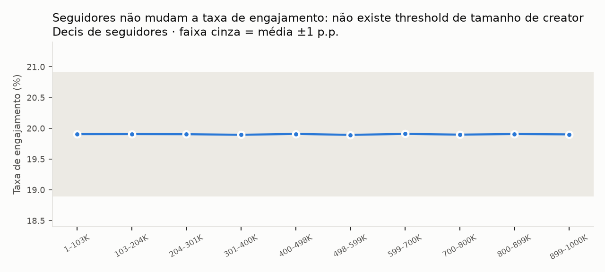

# Relatório estatístico (G3)

> **Em 3 linhas:** nos 31.214 posts de Instagram, TikTok e YouTube, **nenhuma** das 332 comparações da taxa de engajamento (fatores, patrocínio ajustado, por condição e por célula, seguidores, perfis de audiência, hashtags) chega perto da diferença mínima que mudaria verba (±1 p.p.): todas são **EQUIVALENTES**, também com Bonferroni para as 332 e com erro agrupado por creator (`inf-robustness.csv`). Três desfechos secundários do patrocínio (share rate, comment rate, views) não têm veredito, porque a régua vale só para a taxa de engajamento; nenhum é significativo (p ≥ 0,076). A maior diferença encontrada é **0,24 p.p.** e está numa célula pequena; nos fatores gerais, **0,014 p.p.** Nos fatores, o arquivo detectaria efeitos cerca de 50 vezes menores que a régua (MDE mediano 0,019 p.p.), então a ausência de efeito é **comprovada**, e não apenas "não detectada".

Reprodução: `uv run python src/analysis/run_inference.py` · Tabelas: `outputs/tables/inf-*.csv` · Resumo: `inf-summary.json`

**Robustez (G8, após a crítica adversarial):** `uv run python src/analysis/robustness.py` → `inf-robustness.csv`. (1) Cada creator tem em média 6,2 posts no escopo, mas a correlação intraclasse da taxa de engajamento por creator é **−0,001** (efeito de desenho 0,99): tratar os posts como independentes não subestima o erro-padrão. (2) Com Bonferroni para as 332 comparações, o maior limite de equivalência chega a **0,78 p.p.**, ainda dentro de ±1 p.p. (3) Sem correção, o veredito se manteria com qualquer régua a partir de **0,45 p.p.**: a conclusão não depende de a régua ser exatamente ±1 p.p.

## Régua pré-registrada
Definida pelo Douglas **antes** de qualquer teste (`process-log/decisions.md`):
- **Métrica de decisão:** taxa de engajamento = (likes + shares + comentários) / views, em p.p. Média no escopo: **19,90%**.
- **Diferença mínima relevante (SESOI):** **±1 p.p.**
- **Views:** guardrail, sem régua própria.
- **Escopo:** Instagram, TikTok e YouTube. Bilibili e RedNote só como referência.

## Como ler os vereditos
| Veredito | Regra | Tradução para o Head |
|---|---|---|
| **EQUIVALENTE** | IC 90% inteiro dentro de ±1 p.p. (TOST) | "Comprovadamente não faz diferença para a decisão" |
| DIFERENTE, MAS IRRELEVANTE | Equivalente, mas p ajustado < 0,05 | "Existe, mas é pequeno demais para mudar verba" |
| DIFERENTE | p ajustado < 0,05 e não equivalente | "Faz diferença": nenhum caso |
| INCONCLUSIVO | Nem equivalente nem significativo | "Precisa de mais dado": nenhum caso |

Todos os p-valores passam por correção de Benjamini-Hochberg dentro de cada família de testes. **MDE** é o menor efeito que o teste detectaria com 80% de poder.

## Resultados

### 1. O que gera engajamento? Nada que o arquivo registre.
| Família | Comparações | Maior \|diferença\| | MDE mediano | Vereditos |
|---|---:|---:|---:|---|
| Fatores (plataforma, formato, categoria, seguidores, patrocínio, divulgação, idade, gênero, país, idioma, content_length, nº de hashtags), cada nível vs resto | 50 | 0,014 p.p. | 0,019 p.p. | 50 EQUIVALENTE |
| Plataformas, incluindo as 2 de referência | 5 | 0,008 p.p. (Instagram) | — | 5 EQUIVALENTE |

### 2. Patrocínio funciona? É equivalente ao orgânico.
**Comparação justa:** regressão com controles de plataforma, formato, categoria, faixa de seguidores, idade, gênero e país da audiência e idioma. Erros agrupados por creator (os creators se repetem). n = 31.214.

| Desfecho | Efeito do patrocínio | IC 95% | Relativo | p |
|---|---:|---|---|---:|
| **Taxa de engajamento** | **−0,003 p.p.** | −0,014 a +0,008 | −0,07% a +0,04% | 0,55 |
| Share rate | −0,004 p.p. | −0,007 a +0,000 | −0,25% a +0,01% | 0,08 |
| Comment rate | −0,001 p.p. | −0,005 a +0,002 | −0,23% a +0,09% | 0,39 |
| Views (guardrail) | +0,7 views | −1,6 a +3,0 | −0,02% a +0,03% | 0,55 |

**Veredito: EQUIVALENTE.** O pior cenário plausível para o engajamento (−0,014 p.p.) é 70 vezes menor que a régua. O patrocínio também **não compra alcance**: +0,03% de views no melhor cenário.

**Em que condições patrocinar vale a pena?** Testamos 23 condições (plataforma, faixa de seguidores, formato, categoria, tipo de divulgação e categoria do patrocinador): **todas EQUIVALENTES**, com maior diferença de 0,04 p.p. (`inf-sponsorship-conditions.csv`).
- ⚠️ **Armadilha evitada:** patrocinadores de **moda** aparecem com −0,028 p.p. e IC 95% que exclui zero (−0,049 a −0,007). Sem correção, isso vira a manchete "moda é o pior patrocinador", como já apareceu em submissões anteriores. Corrigido para múltiplos testes, p = 0,24, e a diferença é de 0,03 p.p.

**Células comparáveis** (plataforma × categoria × formato × faixa de seguidores, com ≥ 30 posts em cada braço): **81 células, todas EQUIVALENTES**. As diferenças vão de −0,24 a +0,17 p.p. (MDE mediano 0,19). 6 células dão p < 0,05 sem correção e **0 com correção**.

**Custo implícito:** o arquivo não traz custo (DQ-12). O que ele permite é o **teto de valor incremental**: no melhor cenário, o patrocínio adiciona **+0,008 p.p.** de engajamento e **+3 views** por post. Qualquer fee acima do valor desse incremento é prejuízo. A função de break-even entra no G5.

### 3. Existe threshold de seguidores? Não.
- Efeito de ir de 0 a 1 milhão de seguidores: **−0,001 p.p.** (IC 95% −0,020 a +0,018): **EQUIVALENTE**.
- Todos os 10 decis de seguidores ficam em 19,90% ± 0,01.
- A "vantagem de 10 a 180x dos nano-influenciadores" do baseline Grok é um artefato de dividir ~2.010 interações constantes por seguidores (G1).

### 4. Qual audiência engaja mais? Nenhuma.
- 160 perfis (idade × gênero × país), com n mediano de 124 posts: **todos EQUIVALENTES**; maior diferença 0,22 p.p.
- **6 perfis "significativos" sem correção, contra 8 que o puro acaso produziria em 160 testes.** Com correção: 0.
- Lembrete (DQ-13): a audiência é um rótulo único por post, e não a distribuição real de quem interagiu.

### 5. Hashtags: combinação impossível, individual sem efeito
- **93.284 pares** distintos, e **nenhum aparece em mais de 5 posts**. A análise de combinações sugerida no brief não tem volume.
- Das hashtags individuais, só 16 aparecem em ≥ 100 posts, e todas são EQUIVALENTES. A "melhor", **#religious (+0,12 p.p., p = 0,015)**, seria um "insight" para uma IA sem controle. Corrigido: p = 0,23.

### 6. Frequência, horário e duração: não testáveis
- **Frequência:** todos os creators têm 10–11 posts (DQ-09).
- **Horário:** publicação uniforme 24h e sem fuso (DQ-14).
- **Duração:** `content_length` não tem unidade (DQ-10). Os quartis de content_length são EQUIVALENTES.

### 7. Modelo preditivo: NO-GO
HistGradientBoosting com 12 variáveis, validação cruzada com 5 folds agrupados por creator: **R² = −0,001** (pior que prever a média). Um modelo aqui só aprenderia ruído. A decisão de não entregar modelo preditivo é deliberada.

## O que NÃO funciona (com evidência)
1. **Escolher plataforma, formato ou categoria por média**: todas as diferenças ≤ 0,014 p.p.
2. **Contratar por número de seguidores**: efeito de −0,001 p.p. de 0 a 1M.
3. **Pagar patrocínio esperando engajamento ou alcance extra**: equivalente em engajamento, +0,03% de views no melhor caso.
4. **Otimizar hashtags**: sem volume para combinações; individuais equivalentes.
5. **Ler p < 0,05 sem correção**: produziu "moda é ruim", "#religious é bom" e 6 "perfis vencedores", todos ruído.
6. **Dividir engajamento por seguidores** para ranquear creators: gera um ranking 1/x por construção.

## Limitações
- Resultados válidos **para este arquivo**, que foi gerado por sorteio (G2). Eles não dizem que patrocínio não funciona no mundo real; dizem que **este registro não permite saber**.
- Associação, não causalidade: o arquivo não traz o critério de alocação do patrocínio.
- A equivalência vale para a régua de ±1 p.p.; uma régua mais fina exigiria outra decisão de negócio (e ainda passaria: o maior IC 95% nos fatores é ±0,06 p.p.).

## Gate G3
**PASS.** Régua pré-registrada; efeito, IC e MDE reportados; correção múltipla aplicada; NO-GO de ML documentado.

**Para o G4/G5:** a resposta ao Head deixa de ser "onde investir" e passa a ser "**como passar a medir para poder decidir**", com as falhas FP-01 a FP-08.
